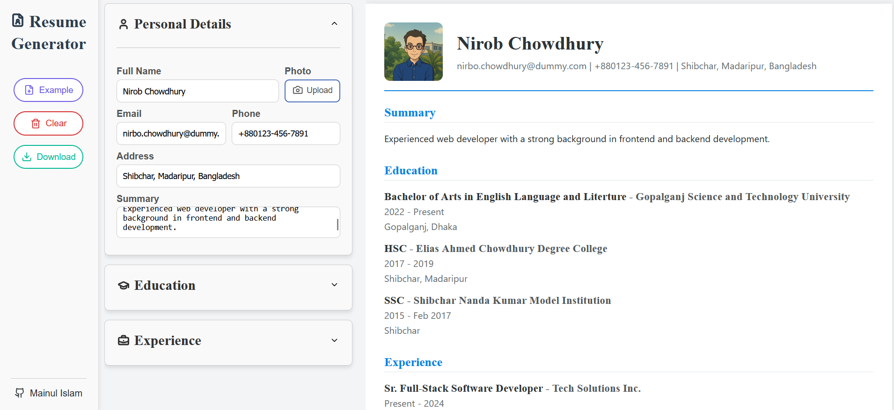

# Resume Generator

A modern and customizable Resume Generator built with React. This app allows users to dynamically fill out their personal, education, and work details, preview a professional resume in real-time, and download it as a PDF.

### Links

Live Site URL: [Generate Your Resume Here 💼📄](https://mainul-islam-nirob.github.io/give-link-later)

### The Final Output

  

## Features

* **Live preview** of resume while editing.
* **Editable sections**: Personal Details, Education, and Experience.
* **Upload and display profile photo**.
* **Download resume** as a professionally formatted PDF.
* **Example resume** loaded by default or with one click.
* **Clear all data** to start fresh anytime.
* **Clean and user-friendly interface**.
* **Fixed sidebar** with navigation buttons and GitHub link.

## Technologies Used

* React
* HTML & CSS
* JavaScript (ES6+)
* `html2pdf.js` for PDF generation
* Lucide-React for icons

## How to Use

1. Enter your personal details, education, and experience in the left panel.
2. Preview your resume in real-time on the right.
3. Upload a profile picture if desired.
4. Click on **Download** to get a PDF copy of your resume.
5. Use **Example** to load a sample resume, or **Clear** to reset everything.

## Plan for Future Improvements

* **Theme customization**
* **Option for adding Projects, Skills, Hobbies, Languages, etc.
* **Drag-and-drop reordering** of education and experience items.
* **Multiple resume templates**
* **Save and load data locally or from cloud**
* **Improved PDF layout with headers and footers**
* **Option to export as DOCX**
* **Mobile responsiveness tweaks**
* **Dark mode toggle**

---

## Author

- Facebook - [@mainul islam](https://web.facebook.com/mmmuinul.islam/)
- LinkedIn - [@mainul islam](https://www.linkedin.com/in/mainul-islam-nirob/)
- Twitter - [@mainul](https://twitter.com/Mainuli96601040)
- Github - [@mainul](https://github.com/Mainul-Islam-Nirob)

---
